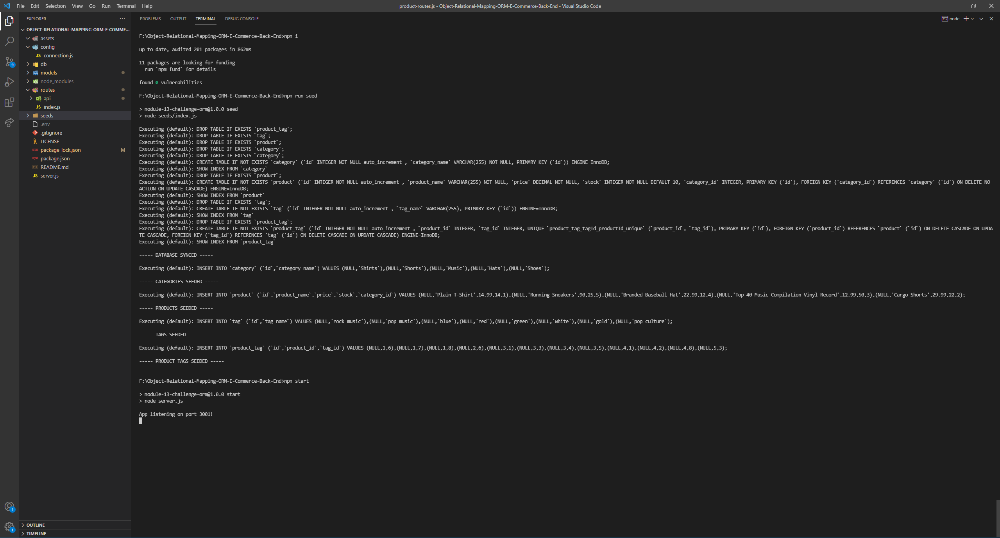
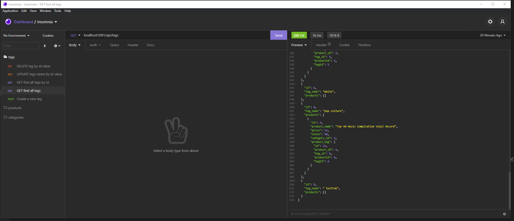
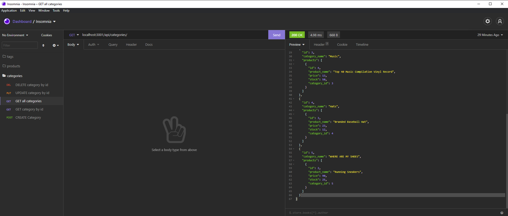
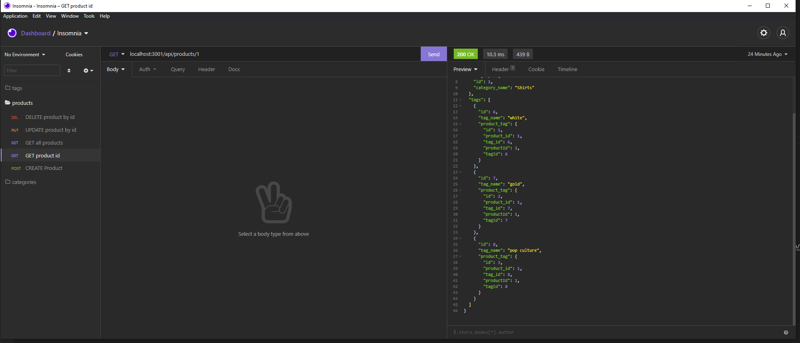

# <Object-Relational-Mapping-ORM-E-Commerce-Back-End>
## Description
to build the back end for an e-commerce site by modifying starter code. configure a working Express.js API to use Sequelize to interact with a MySQL database.

```md
GIVEN a functional Express.js API
WHEN I add my database name, MySQL username, and MySQL password to an environment variable file
THEN I am able to connect to a database using Sequelize
WHEN I enter schema and seed commands
THEN a development database is created and is seeded with test data
WHEN I enter the command to invoke the application
THEN my server is started and the Sequelize models are synced to the MySQL database
WHEN I open API GET routes in Insomnia Core for categories, products, or tags
THEN the data for each of these routes is displayed in a formatted JSON
WHEN I test API POST, PUT, and DELETE routes in Insomnia Core
THEN I am able to successfully create, update, and delete data in my database
```

## Installation
clone repository: (https://github.com/hotsoup42/Object-Relational-Mapping-ORM-E-Commerce-Back-End)
create a `.env` file

- DB_USER=root
- DB_PW=password
- DB_NAME=ecommerce_db

start 'mysql' in terminal `mysql -u root -p`, followed by `source db/schema.sql.`
seed using `npm run seed` in terminal

## Usage
start by in terminal `npm start`
### tutorial links:
[Fist Steps: https://drive.google.com/file/d/1LF1BimNEBpIe9vGOUjML0dTjmI1naqcz/view](https://drive.google.com/file/d/1LF1BimNEBpIe9vGOUjML0dTjmI1naqcz/view)

[Tags:https://drive.google.com/file/d/1LXX65wzF6EQ1xSIvC9xHW4FyJecBWm0k/view](https://drive.google.com/file/d/1LXX65wzF6EQ1xSIvC9xHW4FyJecBWm0k/view)

[Categories: https://drive.google.com/file/d/1kKJhnWIn9SGHxM4Lzu2Rhd8aMlH_Mbre/view](https://drive.google.com/file/d/1kKJhnWIn9SGHxM4Lzu2Rhd8aMlH_Mbre/view)

[Products: https://drive.google.com/file/d/1s5Srr4ii9PBSTl6eHqQdFg-PItTHl5lZ/view](https://drive.google.com/file/d/1s5Srr4ii9PBSTl6eHqQdFg-PItTHl5lZ/view)

    
CLICK ON IMAGES FOR WALKTHROUGH VIDEOS

[](https://drive.google.com/file/d/1LF1BimNEBpIe9vGOUjML0dTjmI1naqcz/view)

[](https://drive.google.com/file/d/1LXX65wzF6EQ1xSIvC9xHW4FyJecBWm0k/view)

[](https://drive.google.com/file/d/1kKJhnWIn9SGHxM4Lzu2Rhd8aMlH_Mbre/view)

[](https://drive.google.com/file/d/1s5Srr4ii9PBSTl6eHqQdFg-PItTHl5lZ/view)


## Credits
Jose E diaz: jose22gw@gmail.com
uw boot camp
## License
MIT
## Badges
[](https://opensource.org/licenses/MIT)
